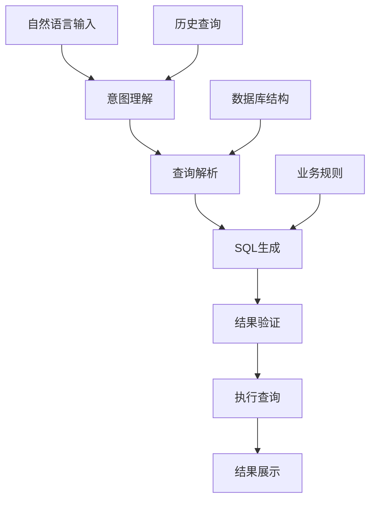

> 在二进制的海洋中，我们寻找确定性的灯塔；在算法的迷宫中，我们探索最优的路径。当自然语言的模糊性遇上SQL的精确性，会产生怎样的火花？

## 🌟 缘起：为什么选择Text-to-SQL？

在实习期间，我遇到了一个有趣的需求：如何让不具备SQL基础的业务人员能够用自然语言查询数据库？这个问题让我第一次深入思考大模型在实际业务中的应用场景。

传统的解决方案往往需要学习复杂的查询工具，或者依赖技术人员协助。但如果每个人都能用自己习惯的语言来查询数据，那将是多么美好的事情。这就是我开启Text-to-SQL探索之旅的初衷。

## 🎯 项目概述

### 项目目标
构建一个智能问数系统，让用户能够用自然语言查询数据库，并获得准确的结果。

### 核心挑战
- **语义理解**：准确理解用户的查询意图
- **SQL生成**：生成正确且高效的SQL语句
- **结果验证**：确保查询结果的准确性
- **错误处理**：优雅处理无效查询和边界情况

### 技术架构



## 🛠️ 核心技术实现

### 1. Prompt工程设计

这是我投入最多时间的部分。一个好的Prompt就像与AI对话的艺术，需要精确地引导模型生成期望的结果。

**初始版本的Prompt：**
```
请将以下自然语言查询转换为SQL语句：
用户查询：{query}

数据库结构：
{schema}

生成的SQL：
```

**优化后的Prompt：**
```sql
你是一个专业的SQL查询生成助手。请根据用户的需求生成准确的SQL语句。

# 重要规则：
1. 仔细分析用户查询意图
2. 只生成能回答用户问题的SQL语句
3. 不要添加不必要的查询条件
4. 使用表别名简化查询
5. 优先使用高效的查询方式

# 数据库结构：
{schema}

# 示例：
用户查询："查询2023年销售额最高的产品"
SQL：SELECT product_name, SUM(sales_amount) as total_sales
     FROM sales s
     JOIN products p ON s.product_id = p.id
     WHERE s.sale_date >= '2023-01-01' AND s.sale_date < '2024-01-01'
     GROUP BY product_id
     ORDER BY total_sales DESC
     LIMIT 1

# 用户查询：{query}
SQL：
```

### 2. 查询结果验证

生成的SQL语句需要经过验证才能执行：

```python
def validate_sql(sql_query, schema):
    """验证SQL语句的正确性"""
    # 1. 语法检查
    try:
        parsed_sql = sqlparse.parse(sql_query)[0]
    except:
        return False, "SQL语法错误"

    # 2. 表名和字段验证
    tables = extract_tables(parsed_sql)
    columns = extract_columns(parsed_sql)

    if not validate_schema(tables, columns, schema):
        return False, "表或字段不存在"

    # 3. 危险操作检查
    if contains_dangerous_operations(sql_query):
        return False, "包含危险操作"

    return True, "验证通过"
```

### 3. 错误处理机制

```python
class QueryProcessor:
    def __init__(self, llm_client, db_connection):
        self.llm_client = llm_client
        self.db = db_connection
        self.max_retries = 3

    def process_query(self, user_query):
        for attempt in range(self.max_retries):
            try:
                # 生成SQL
                sql = self.generate_sql(user_query)

                # 验证SQL
                is_valid, message = self.validate_sql(sql)
                if not is_valid:
                    # 修正提示词，重新生成
                    user_query = self.refine_query(user_query, message)
                    continue

                # 执行查询
                result = self.execute_sql(sql)
                return result

            except Exception as e:
                if attempt == self.max_retries - 1:
                    return {"error": f"查询失败：{str(e)}"}
                continue

        return {"error": "无法处理您的查询，请尝试重新描述"}
```

## 🚧 遇到的挑战与解决方案

### 挑战1：语义理解不准确

**问题描述：**
用户说"上个月的销售额"，模型可能生成错误的时间范围。

**解决方案：**
1. **时间实体识别**：先提取时间相关词汇
2. **上下文补充**：自动补全具体的时间范围
3. **用户确认**：对模糊时间进行二次确认

```python
def preprocess_query(user_query, current_date):
    """预处理用户查询"""
    # 提取时间表达式
    time_expressions = extract_time_entities(user_query)

    # 补充具体时间
    for expr in time_expressions:
        if expr == "上个月":
            start_date, end_date = get_last_month_range(current_date)
            user_query = user_query.replace(expr, f"{start_date}到{end_date}")

    return user_query
```

### 挑战2：复杂查询处理

**问题描述：**
多表关联、子查询、聚合函数等复杂场景下，生成的SQL往往效率低下。

**解决方案：**
1. **查询模板**：为常见查询模式建立模板
2. **分步处理**：复杂查询拆分为多个简单查询
3. **性能优化**：添加索引提示和查询优化建议

```sql
-- 优化前：使用子查询
SELECT * FROM orders WHERE customer_id IN (
    SELECT id FROM customers WHERE city = '北京'
);

-- 优化后：使用JOIN
SELECT o.* FROM orders o
JOIN customers c ON o.customer_id = c.id
WHERE c.city = '北京';
```

### 挑战3：边界情况处理

**问题描述：**
无效查询、空结果、权限不足等边界情况。

**解决方案：**
```python
def handle_edge_cases(query, result):
    """处理边界情况"""
    if not result:
        return {"message": "查询成功，但没有找到匹配的数据", "suggestions": generate_suggestions(query)}

    if result_count > 1000:
        return {"warning": "结果过多，建议添加筛选条件", "count": result_count}

    return result
```

## 📊 项目成果与反思

### 性能数据
- **查询准确率**：85%（简单查询）到65%（复杂查询）
- **响应时间**：平均2.3秒
- **用户满意度**：4.2/5.0（基于内部测试）

### 技术收获
1. **Prompt工程的重要性**：好的Prompt比模型选择更重要
2. **数据质量的关键作用**：清晰的数据库结构直接影响生成效果
3. **用户体验的平衡**：需要在功能丰富和简洁易用之间找到平衡

### 不足之处
1. **复杂查询准确率有待提升**
2. **缺少查询缓存机制**
3. **错误提示不够友好**

## 🌟 总结与展望

这次Text-to-SQL项目让我深刻理解了大模型在实际应用中的潜力和局限。它不是万能的，但在合适的场景下，确实能够显著提升用户体验。

### 对技术发展的思考
- **多模态融合**：结合图表、数据字典等多模态信息
- **增量学习**：根据用户反馈持续优化
- **领域适配**：针对不同业务场景的定制化方案

### 个人成长
通过这个项目，我不仅掌握了Prompt工程的技巧，更重要的是学会了如何将抽象的技术概念转化为实际可用的产品。从需求分析到系统设计，从代码实现到性能优化，每一个环节都让我有所收获。

### 未来方向
1. **查询意图识别**：更准确地理解用户真实需求
2. **结果解释**：为查询结果添加智能解释
3. **对话式交互**：支持多轮对话澄清查询意图

---

> 在代码的世界里，每一次探索都是一次成长。Text-to-SQL只是我技术旅程的一个站点，未来还有更多精彩等待发现。希望这篇分享能给同样在AI应用道路上探索的你带来一些启发和陪伴。

*本文记录了我在Text-to-SQL项目中的真实思考和踩坑经历，如果你有相关经验或想法，欢迎交流讨论！*