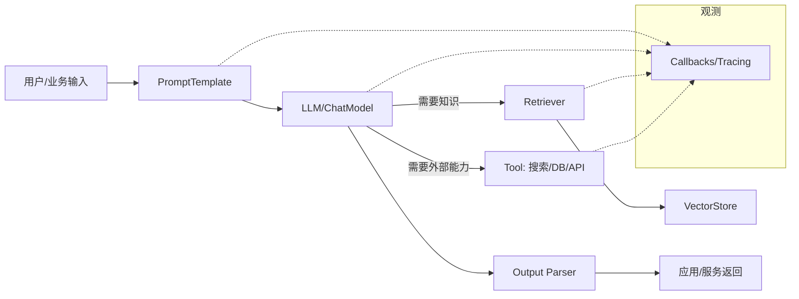

# 【LangChain】什么是 LangChain

> 一句话理解：LangChain 是一套“用组件化方式搭建 LLM 应用”的工程框架，帮助你把提示词、模型调用、检索、工具调用、状态与观察等环节标准化、可组合、可观测。

## 为什么需要 LangChain？

在真实业务里，LLM 并不是“问一句答一句”那么简单，常见痛点包括：

- 数据接入：需要读取文档、网页、数据库，并进行切分、向量化与召回（RAG）。
- 程序编排：需要把提示词、模型、工具调用、过滤与后处理按步骤组合。
- 可观测与评测：需要追踪每次调用、耗时、错误、Token 成本，并做离线/在线评估。
- 生产特性：需要重试、超时、并发、缓存、路由、AB 实验等工程能力。

LangChain 把这些“重复造的轮子”做成标准化组件和可复用范式，降低从 Demo 到生产的门槛。

## 核心概念速览

- 模型与输出
  - Model：`LLM`/`ChatModel` 的统一接口（如 OpenAI、Claude、本地模型等）。
  - Output Parser：把模型输出解析为结构化数据（JSON、函数调用结果等）。
- 组合与编排
  - PromptTemplate：参数化提示词模板。
  - Chain / Runnable（LCEL）：支持通过 `pipe` 连接各组件形成数据流式的可组合“链”。
  - Router / Multi-prompt：根据输入路由到不同链路（如多技能代理）。
- 工具与代理
  - Tool：把外部能力（搜索、数据库、HTTP、代码执行等）以“函数”形式暴露给模型。
  - Agent：让模型“决定下一步该用哪个工具”，并循环地感知-计划-执行。
- 检索增强（RAG）
  - Loader / Splitter：文档加载与切分。
  - Embeddings / VectorStore：向量化与向量库（FAISS、Milvus、PGVector 等）。
  - Retriever：根据查询从向量库/知识库检索相关片段。
- 观测与治理
  - Callbacks / Tracing：记录每次调用的链路、耗时、错误、Token 用量。
  - Evaluators：自动化评估（相关性、事实性、风格一致性等）。

## 一张图看懂（Mermaid）



## 快速上手示例

以下示例演示“提示 → 模型 → 解析”的最小链路。不同版本 API 略有差异，核心思想一致：用“模板 + 模型 + 解析”串起来。

### TypeScript（LangChain.js 示例）

```ts
// 假设已安装：@langchain/core、@langchain/openai（或其它厂商SDK）
import { ChatOpenAI } from "@langchain/openai";
import { PromptTemplate } from "@langchain/core/prompts";
import { StringOutputParser } from "@langchain/core/output_parsers";

const model = new ChatOpenAI({ model: "gpt-4o-mini", temperature: 0 });
const prompt = PromptTemplate.fromTemplate("用100字以内回答：{question}");

const chain = prompt
  .pipe(model)               // 把模板产出的消息送入模型
  .pipe(new StringOutputParser()); // 把消息解析成纯文本

const res = await chain.invoke({ question: "LangChain 的核心价值是什么？" });
console.log(res);
```

### Python（LangChain Python 示例）

```python
# 假设已安装：langchain, langchain-openai 等
from langchain_openai import ChatOpenAI
from langchain_core.prompts import ChatPromptTemplate
from langchain_core.output_parsers import StrOutputParser

model = ChatOpenAI(model="gpt-4o-mini", temperature=0)
prompt = ChatPromptTemplate.from_template("用100字以内回答：{question}")

chain = prompt | model | StrOutputParser()
res = chain.invoke({"question": "LangChain 的核心价值是什么？"})
print(res)
```

## 典型场景

- RAG 问答：接入企业文档/数据库，构建检索增强问答（多路召回、重排、结构化输出）。
- 数据处理与自动化：批量清洗、抽取、改写文本，结构化成 JSON。
- 多工具智能体：让模型基于工具反馈自我规划（搜索→抓取→总结→结构化）。
- 工作流编排：把多个步骤（抽取→检索→生成→校验）用 LCEL 链接、并发与路由。

## 何时不建议使用 LangChain？

- 只需“单轮问答”的极简场景：直接调用 SDK 性价比更高。
- 强约束、稳定 API 的流程编排：用通用工作流编排器（如 Airflow/Temporal）会更清晰。
- 对延迟极度敏感的内环：直接 SDK + 轻量工具可减少中间层开销。

## 与其他方案的对比

- LlamaIndex：更专注“数据-检索-索引”的一体化抽象，RAG 体验更顺手；LangChain 生态与编排更丰富。
- Haystack：企业检索/问答起家，传统 NLP + 向量检索结合较好；LangChain 对多厂商与代理/工具生态更全面。
- 直接 SDK：简单直接、可控性强；但需要自己补齐检索、解析、观测与评测等工程能力。

## 最佳实践清单

- 采用 LCEL（`pipe`/`|`）构建可组合链路，最小化胶水代码。
- 明确定义输入/输出模式（JSON Schema），用 Output Parser 强约束格式。
- 对外部调用设置超时、重试、并发与缓存策略；关键环节做熔断与降级。
- 使用回调/Tracing 打点：记录 Token、时延、错误，便于成本与质量治理。
- RAG 关注数据质量：切分粒度、召回覆盖率、重排与事实性评估。
- 引入评测：离线基准（针对代表性案例集）+ 在线指标（答案点击率/正确率）。
- 分层设计：把“业务规则”和“LLM 调用”隔离，方便回归与替换模型。

## 小结

LangChain 的价值不在“能不能调模型”，而在于“以工程化方式组合各类能力并可持续迭代”。当你的应用需要检索、工具调用、可观测、评测与编排时，用 LangChain 能显著降低复杂度、提升可维护性；而在超轻量场景，直接 SDK 也许更合适。

—— 这篇文章是系列《LangChain 实战》的起始篇，后续将覆盖 RAG、Agent、评测与生产化落地等主题。

