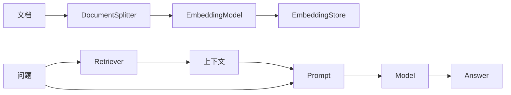

# 【LangChain4j】什么是 LangChain4j

> 一句话理解：LangChain4j 是面向 Java 的 LLM 应用开发库，提供提示模板、链式编排、RAG、工具函数与代理（Agent）等组件，帮助 Java 团队像写常规业务一样组织 AI 能力。

## 为什么用它

- Java 友好：纯 Java API，和常见的工程实践（分层、依赖注入、配置化）契合。
- 组件齐全：`Model`、`PromptTemplate`、`OutputParser`、`Tool/Function`、`Embeddings`、`VectorStore`、`Retriever`、`Agent`。
- 灵活轻量：不绑定框架（可配合 Spring Boot），按需引用模块，适合增量引入。

## 快速上手（最小示例）

### 依赖

```xml
<!-- pom.xml -->
<dependency>
  <groupId>dev.langchain4j</groupId>
  <artifactId>langchain4j-openai</artifactId>
  <version>最新稳定版</version>
</dependency>
```

### 聊天最小例子（AiServices）

```java
import dev.langchain4j.service.*;
import dev.langchain4j.model.openai.OpenAiChatModel;

interface Assistant {
  @UserMessage String chat(String userMessage);
}

public class Demo {
  public static void main(String[] args) {
    var model = OpenAiChatModel.withApiKey(System.getenv("OPENAI_API_KEY"));
    var assistant = AiServices.create(Assistant.class, model);
    System.out.println(assistant.chat("用一句话介绍 LangChain4j"));
  }
}
```

### 提示模板与结构化输出

```java
import dev.langchain4j.service.*;

record Summary(String summary, java.util.List<String> keywords) {}

interface Summarizer {
  @SystemMessage("请输出JSON，包含 summary 与 keywords")
  @UserMessage("{text}")
  Summary summarize(@V("text") String text);
}

var summarizer = AiServices.create(Summarizer.class, model);
var res = summarizer.summarize("简要说明LangChain4j的特点");
```

## RAG（检索增强）思路

- 切分：`DocumentSplitter` 将长文档分块。
- 嵌入与向量库：`EmbeddingModel` + `EmbeddingStore`（如内存/PGVector/Milvus）。
- 检索：`Retriever` 召回相关块 → 作为上下文注入模板与模型对话。



## 何时选择 LangChain4j / Spring AI

- LangChain4j：偏纯 Java 库、灵活定制、与任意框架搭配；想要轻量编排与快速 PoC 的团队。
- Spring AI：更 Spring 化（自动装配/配置/观测/治理），适合 Spring Boot 体系内的生产应用。

## 最佳实践

- 使用接口式 `AiServices` 搭配注解语义化提示，复杂场景再落到底层 API。
- 通过 `OutputParser` 或对象绑定强约束输出格式，降低下游解析成本。
- RAG 优先保证数据质量与检索覆盖，再考虑模型与参数微调。
- 对外部调用加上超时/重试/缓存，并记录调用链路与成本（可接入日志/观测系统）。

—— 本文为“LangChain4j 实战”系列起篇，后续可补充 RAG/工具函数/Agent 的工程落地示例。

