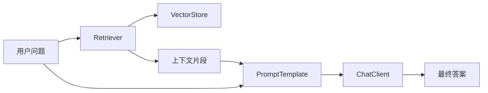

# 【Spring AI】什么是 Spring AI

> 一句话理解：Spring AI 是 Spring 官方推出的“AI 应用开发抽象层”，以 Spring Boot 方式把大模型调用、提示工程、RAG、函数调用、工具/向量库以及观测统一封装，帮助 Java/Spring 团队快速把 AI 能力落到生产。

## 能解决什么问题

- 统一模型调用：对接 OpenAI、Azure OpenAI、Ollama 等厂商，暴露一致接口（`ChatClient`、`ImageClient`）。
- 提示与输出：`PromptTemplate` 参数化提示，`OutputParser` 结构化解析（JSON/对象绑定）。
- RAG 组件：文档加载/切分、嵌入模型、`VectorStore`（如 PGVector、Milvus、Redis）与 `Retriever`。
- 工具与函数调用：函数/工具以 Spring Bean 方式注册，支持模型选择何时调用。
- Spring 化的治理：配置（YAML）、自动装配、`@Configuration`、`Observation`/`Micrometer` 观测、重试与缓存等。

## 快速上手（最小示例）

### 依赖与配置

```xml
<!-- pom.xml -->
<dependency>
  <groupId>org.springframework.ai</groupId>
  <artifactId>spring-ai-openai-spring-boot-starter</artifactId>
  <version>最新稳定版</version>
  <scope>runtime</scope>
  </dependency>
```

```yaml
# application.yml
spring:
  ai:
    openai:
      api-key: ${OPENAI_API_KEY}
      chat:
        options:
          model: gpt-4o-mini
          temperature: 0.2
```

### 控制器示例

```java
// 简约示例：注入 ChatClient，直接调用
@RestController
@RequestMapping("/api/ai")
public class AiController {

  private final ChatClient chatClient;

  public AiController(ChatClient chatClient) {
    this.chatClient = chatClient;
  }

  @GetMapping("/qa")
  public String qa(@RequestParam String q) {
    return chatClient.prompt(p -> p
        .user("请用100字以内回答：{q}")
        .param("q", q)
      ).call().content();
  }
}
```

### 输出解析（结构化）

```java
record Answer(String summary, List<String> keywords) {}

var res = chatClient.prompt(p -> p
    .system("请输出JSON，字段：summary, keywords")
    .user("{text}")
    .param("text", "介绍Spring AI的核心优势")
  )
  .call()
  .entity(Answer.class); // 直接映射到对象
```

## RAG（检索增强）思路

- 文档切分：基于 `DocumentReader` + `TextSplitter` 把长文档切块。
- 嵌入入库：`EmbeddingModel` 生成向量，写入 `VectorStore`（PGVector/Redis/Milvus）。
- 查询时：`Retriever` 召回相关分片 → 作为上下文拼入 `PromptTemplate` → `ChatClient` 生成答案。

Mermaid 示意：



## 适用与对比

- 适用：已有 Spring 基建与 CI/CD，追求“配置化 + 自动装配 + 生产可观测”的 Java 团队。
- 对比 LangChain（JS/Python）：Spring AI 更贴合 Spring 生态与生产治理；编排抽象相对克制但与 Spring 特性深度融合。

## 最佳实践

- 使用 `PromptTemplate` + `OutputParser` 约束格式，避免自由文本难解析。
- 结合 `Observation/Micrometer` 记录 Token/耗时/错误，落盘可追踪。
- RAG 先优化数据：切分粒度、去噪与索引策略优先于“堆参数”。
- Bean 化工具与校验逻辑，便于统一治理（重试/熔断/限流）。

—— 本文为“Spring AI 实战”系列起篇，后续会补充 RAG 与函数调用的落地示例。

